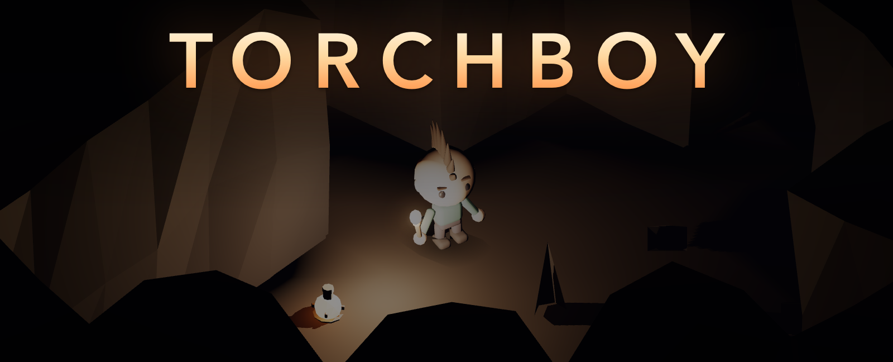
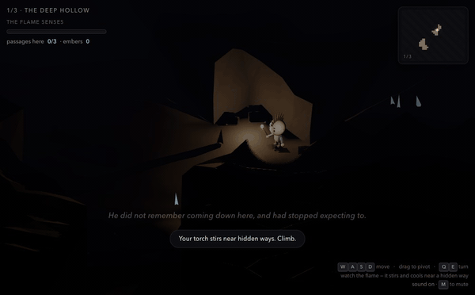
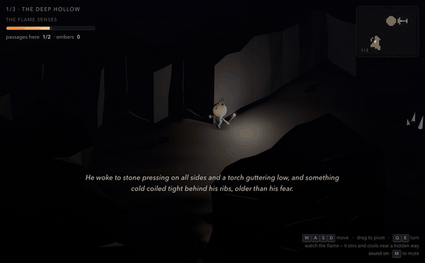
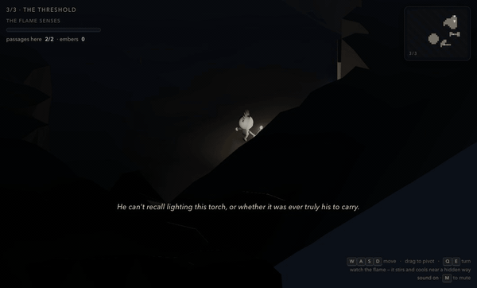

# Torchboy

**An experiment in how far coding agents can actually go.**

Not a serious game — an academic exercise. The interesting artefact is not the
game; it's that a small boy with an enormous head, the cave he's trapped in, the
music, and the story he's told were all produced in a conversation, from 27
prompts, with no code typed by hand.



The game underneath is real and playable: you are alone in a cave holding the
only light, and the passages out are sealed behind rock that looks exactly like
every other wall. Your torch is the instrument that finds them.

```bash
npm install && npm run dev        # http://localhost:5173
```

or, with nothing installed but Docker:

```bash
docker compose up --build         # http://localhost:8080
```

---

## The experiment

|  |  |
|---|---|
| Prompts from the human | **27** |
| Tool calls by the agent | **793** |
| Elapsed | ~25 hours over two days |
| Lines of code typed by hand | **0** |

The prompts are almost entirely art direction and bug reports rather than
instructions — *"the head is not moving"*, *"it sounds sort of like rushing
air"*, *"the tin whistle piece is weird"*, *"lol maybe not go down again"*. The
whole game is specified in about two pages of plain English.

The agent drove **Blender** over MCP to author the meshes and rig, **Playwright**
to drive and verify the real game in a real browser (286 calls), and a great deal
of `bash` to measure things that cannot be eyeballed.

**That last part is the finding.** Every serious bug in this project *looked
fine*:

- The character was "animated" for a whole session while **1750 of its 1792
  vertices had no vertex group** — the clips played, the bones moved, and nothing
  on screen budged.
- The choir "sounded ethereal" while measuring **1.48× noise to pitched signal**.
  It was wind, not a voice.
- Foot-slide was "a bit off" at **5.91×**.

None of those were found by looking. They were found by measuring, and the
project now runs on that rule.

📖 **[How this was built](docs/HOW-THIS-WAS-BUILT.md)** — which tools did which
work, when, why, and the four lessons that cost the most.

📜 **[The full transcript](docs/transcript/)** — all 27 prompts and everything
that followed each one, including the wrong turns, the misdiagnoses, and the
corrections. This is the actual point of the repo.

---

## What came out of it

**The torch is the instrument.** The flame stirs and cools toward blue-white as
a hidden way comes into range; the wall dissolves, the passage opens, and
something ancient comes up out of the floor and into him.



**The way up has to be earned.** A cavern keeps its staircase until every
passage hidden in it is open — and not by locking it: until then the way up is
simply *absent*, unlit and off the map.



**The ending takes the controls away.** He walks the last steps into the
daylight and comes apart upward, and Claude writes the last of his story knowing
everything that happened in the run.



<sub>Clips are recorded at a slightly closer camera than the game ships with, so
the boy reads at GIF size. Nothing else is altered — same lighting, same rules,
driven through the real keyboard input.</sub>

---

## Nothing here is authored ahead of time

Which is really the second half of the experiment — how much of a game can be
generated rather than made?

- **The caves** are built by cellular automata in the browser at load and
  re-rolled until they pass their own design rules. There is no level file.
- **The geometry** is built from those grids as three.js `BufferGeometry`; the
  2.4MB cavern mesh is gone entirely.
- **The music** has no audio files. The score is synthesised, and the choir that
  rises as you near something worth finding is a physically-modelled vocal tract
  — a Kelly–Lochbaum waveguide in an AudioWorklet.
- **The story** is written by Claude *while you play*, from a log of where you
  actually went and what you actually found. Never the same twice.
- **The art** is generated by Python in Blender. No mesh was modelled by hand.

Three caverns, climbed rather than descended, because the end-game is escape.
Built with [three.js](https://threejs.org). Runs in any modern browser; no
credentials or Blender install needed to play.

## If you want to poke at it

Everything technical is in **[`docs/`](docs/)**, laid out so a coding agent can
navigate it — [`AGENTS.md`](AGENTS.md) is a table of contents rather than a
manual, and `CLAUDE.md` is symlinked to it.

| | |
|---|---|
| [docs/HOW-THIS-WAS-BUILT.md](docs/HOW-THIS-WAS-BUILT.md) | building it with coding agents |
| [docs/transcript/](docs/transcript/) | the full session transcript |
| [docs/ARCHITECTURE.md](docs/ARCHITECTURE.md) | how the system fits together, and the rules that hold it |
| [docs/SETUP.md](docs/SETUP.md) | toolchain, optional API credentials, Blender |
| [docs/WORKFLOWS.md](docs/WORKFLOWS.md) | how to make a change and verify it |
| [docs/DEPLOYMENT.md](docs/DEPLOYMENT.md) | the container |
| [docs/systems/](docs/systems/) | story, audio, rendering, assets |
| [docs/adr/](docs/adr/) | why the load-bearing decisions were made |

## License

[MIT](LICENSE) — do what you like with it. Every asset in this repo is generated
by the scripts in `blender/`; no third-party art is vendored.

## Credits

Style reference: [Kenney](https://kenney.nl/assets) kits — chunky proportions,
flat facets, muted palette. No Kenney assets are used; every mesh here is
generated by the scripts in `blender/`. The loader is generic, so dropping real
Kenney props in is straightforward.
